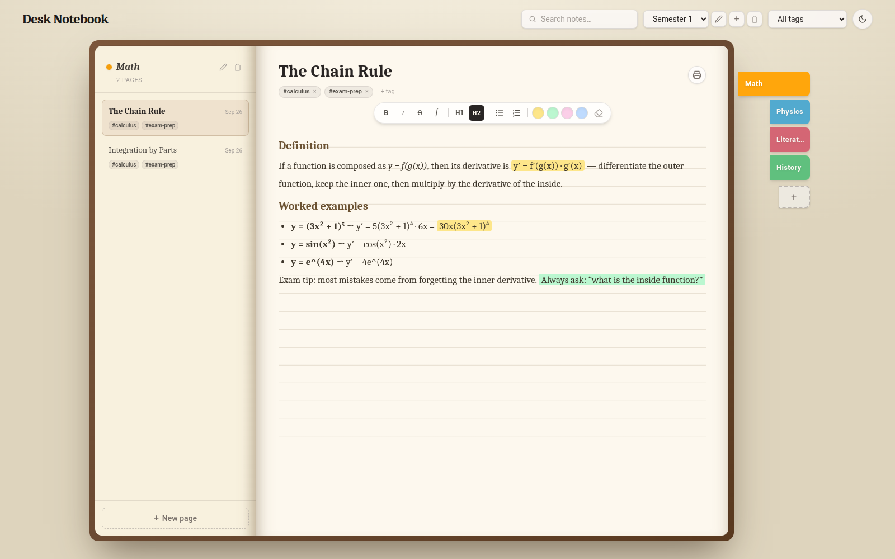
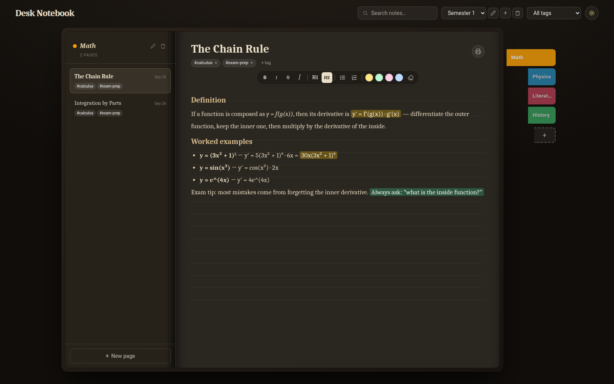

# Desk Notebook

A note-taking app that looks like a physical book on your desk. Each notebook
has colored binder tabs on the side, one per class or topic, and inside each
section you write pages with rich text, highlights, tags, and tables.

Everything is stored locally on your computer. No account, no cloud, no
subscription. It is open source and free.

<p align="center">
  
  
</p>

## Download

**Windows**: download `Desk-Notebook-Setup-x.y.z.exe` from the
[releases page](https://github.com/ZamoRzgar/Desk-Notebook/releases) and run
it. Windows may show a "protected your PC" warning because the app is not
code-signed. Click "More info", then "Run anyway". This is normal for small
independent apps.

**Linux**: two choices from the same releases page.

- `.deb` (Ubuntu, Mint, Debian): `sudo apt install ./desk-notebook_*_amd64.deb`
- AppImage (any distro): download it, `chmod +x`, and run the file.

**In China**: download from the Gitee mirror instead:
[gitee.com/zamo97/Desk-Notebook](https://gitee.com/zamo97/Desk-Notebook)

The app checks for updates when it starts and updates itself. Your notes live
in your own user folder and are never touched by updates or uninstalls.

## What it can do

- Open-book layout with ruled paper, a leather-style cover, and colored binder
  tabs you can rename and recolor. One book can hold every class or project.
- Simple rich text editor: bold, italic, headings, lists, and tables. Pasting
  a table from a web page keeps its structure, and wide tables shrink to fit
  the page.
- Math symbol picker (integrals, Greek letters, arrows, superscripts) for
  class notes.
- Four highlight colors, tuned to stay readable in both light and dark mode.
- Tags on every page, with a filter to find them later.
- Instant full-text search across the whole book.
- Export a single page or a whole section to PDF through the print dialog.
- Dark mode for late nights.

## Run from source

You need Node.js 22 or newer.

```bash
npm install
npm run dev
```

Open http://localhost:5173/ in a browser. The app starts with a sample book
("Semester 1") so you can look around before writing your own notes.

To run it as a real desktop window:

```bash
npm run build
npm run electron:start
```

## Build the installers

Linux (AppImage and .deb):

```bash
npm run dist:linux
```

If GitHub downloads are blocked on your network, set these mirrors first:

```bash
export ELECTRON_MIRROR=https://npmmirror.com/mirrors/electron/
export ELECTRON_BUILDER_BINARIES_MIRROR=https://npmmirror.com/mirrors/electron-builder-binaries/
```

The Windows installer is built by GitHub Actions (see
`.github/workflows/release.yml`), because the SQLite module has to be compiled
on Windows. Push a version tag to trigger a build:

```bash
npm version patch
git push origin main --tags
```

A few minutes later a draft release appears with the `.exe`, AppImage, and
`.deb`. Publish it, and every installed app updates itself on next start.

## Tech stack

Electron, React, TypeScript, Vite, Tailwind CSS, TipTap (the editor), and
better-sqlite3 (storage).

## Notes and limitations

- Notes save automatically as you type.
- The browser preview uses localStorage and is only for trying the app. The
  desktop app uses a real SQLite database.
- Deleted pages cannot be undone yet, and search covers one book at a time.
- Found a bug or have an idea? Open an issue on GitHub or Gitee.
